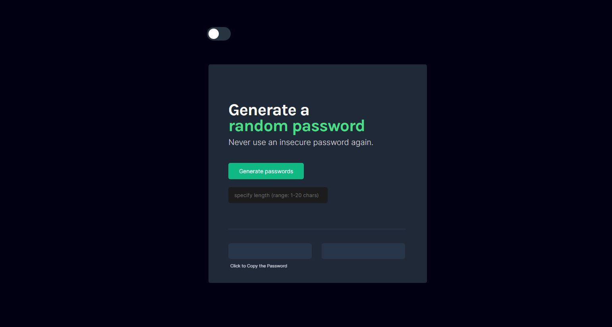
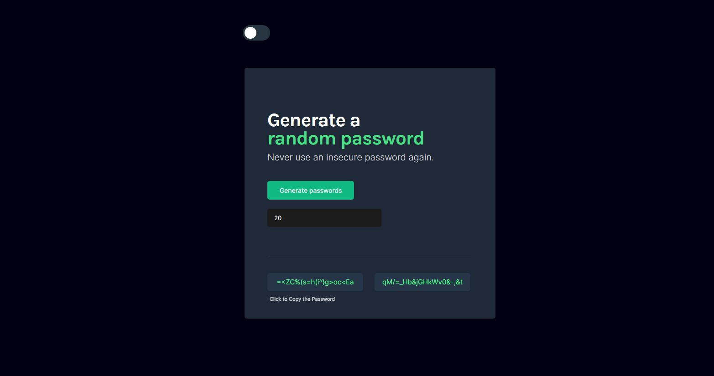
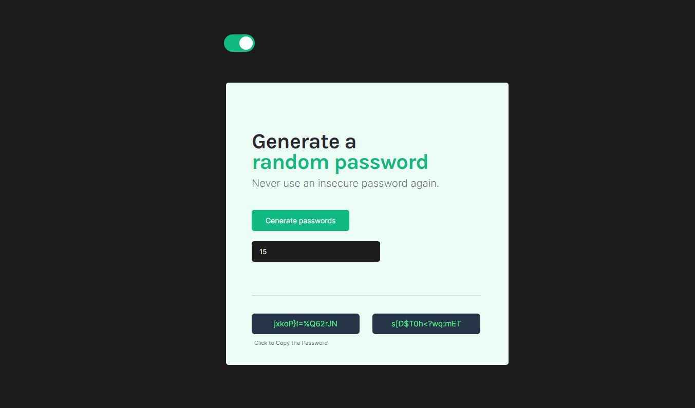

# Scrimba Practice Project - Password Generator

Live URL: [Password Generator](https://aditi002-holo.github.io/password-generator/)  
Repo URL: [Password Generator Code](https://github.com/Aditi002-holo/password-generator)

## Unit Converter

Initial State

Populated State

Light Theme 

## What did I learn?

- Styling
- Rendering content
- Generating Random Characters of specific length
- Adding input field
- Adding theme toggle
- CopyToClipboard option with clipboard.writeText()
- Using this in onclick()

## Resources

- [Scrimba - JavaScript Course](https://scrimba.com/learn/learnjavascript)